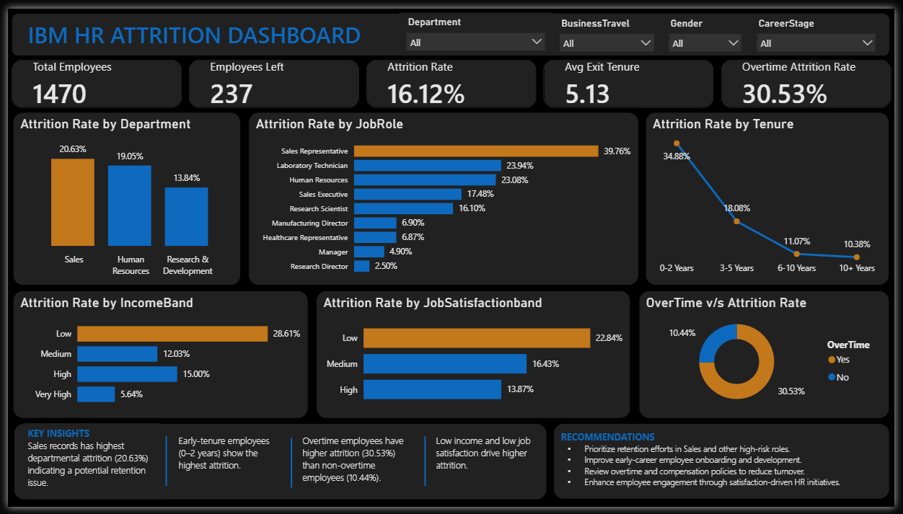

# IBM HR Attrition Analysis Dashboard

## Overview
An end-to-end HR analytics project built using **SQL Server** and **Power BI** to identify key factors driving employee attrition. The project includes data cleaning, SQL analysis, DAX measures, and an interactive executive dashboard.

## Tools Used
- SQL Server
- Power BI
- DAX

## Business Problem
Employee attrition increases recruitment costs and impacts business performance. This dashboard helps HR identify high-risk departments, job roles, and employee groups to support retention strategies.

## Dashboard Features
### KPIs
- Total Employees
- Employees Left
- Attrition Rate
- Average Exit Tenure
- Overtime Attrition Rate

### Visuals
- Attrition by Department
- Attrition by Job Role
- Attrition by Experience Band
- Attrition by Income Band
- Attrition by Job Satisfaction
- Overtime vs Attrition

## Dashboard Preview



## Key Insights
- Overall attrition rate is **16.12%** (237 employees).
- **Sales** has the highest departmental attrition.
- Employees with **0–2 years** of service have the highest attrition.
- Employees working **overtime** are significantly more likely to leave.
- Employees in the **Low Income Band** have the highest attrition.

## Recommendations
- Focus retention efforts on Sales and other high-risk roles.
- Strengthen onboarding for early-career employees.
- Review overtime and compensation policies.
- Improve employee engagement and job satisfaction.

## Repository Structure
```
IBM-HR-Attrition-Analysis/
│
├── HR-DASHBOARD.pbix
├── Dashboard.png
├── README.md
└── SQL Scripts/
    ├── EmpAttritionDataQualtyChecks.sql
    ├── EmpAttritionEDA.sql
    └── vw_EmployeeAttritionAnalytics.sql
```

## Skills Demonstrated
SQL • Data Cleaning • EDA • Data Modeling • DAX • Power BI • Dashboard Design • Business Intelligence
